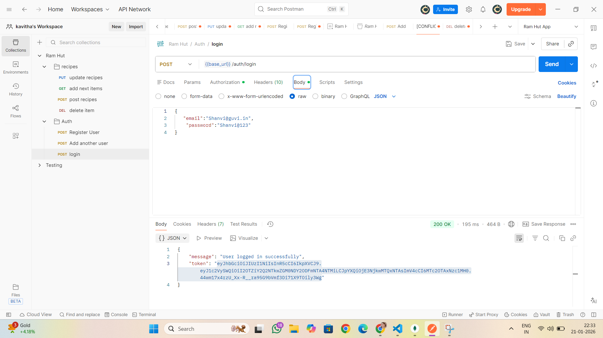
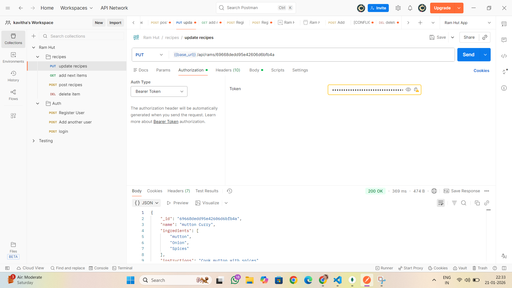
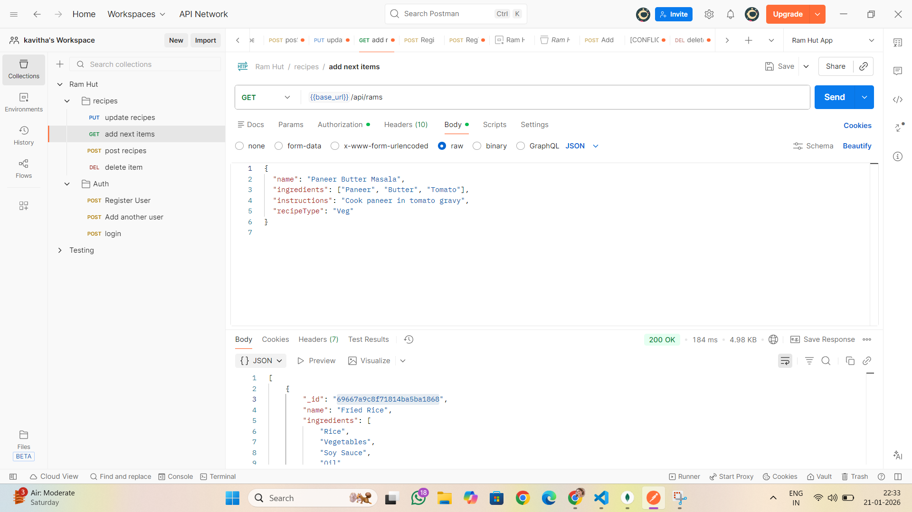
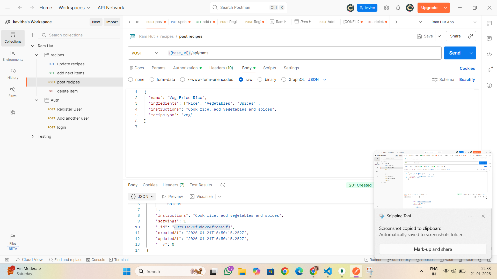

## 🧠 RAM Management API

This project is a RESTful API for managing RAM products with JWT-based authentication.

### Features
- User registration & login
- JWT authentication
- Protected CRUD operations
- MongoDB with Mongoose
- Postman-tested endpoints

### Public Routes
- GET /api/rams

### Protected Routes (JWT Required)
- GET /api/rams/:id
- POST /api/rams
- PUT /api/rams/:id
- DELETE /api/rams/:id

## API Testing with Postman

All API endpoints were tested using Postman.

### Register API

### login API

### Delete Recipe API

### Put Recipe API

### Get Recipe API

### Post Recipe API

